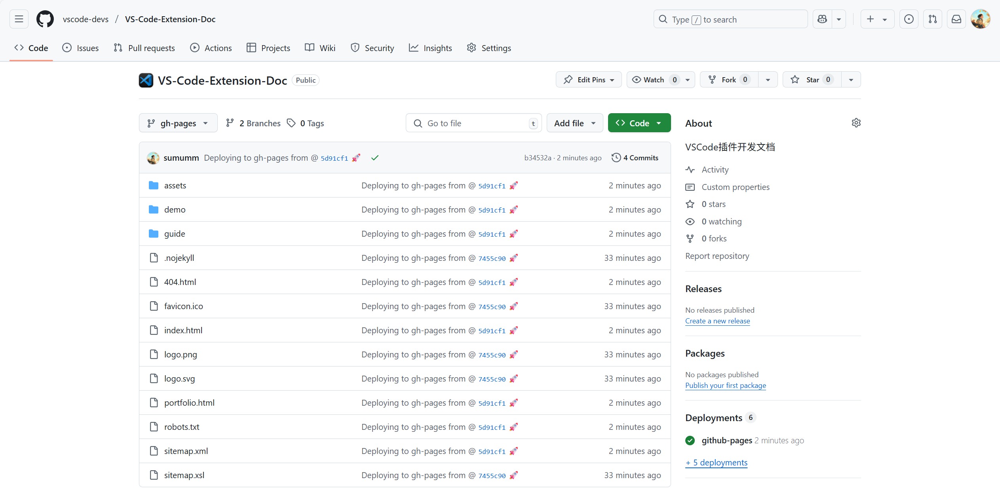
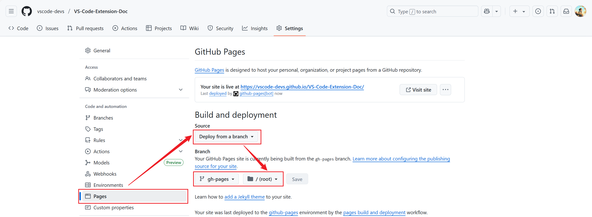

# <font size=3>VS Code 扩展开发文档</font>

## <font size=3>1. 开发环境</font>

[](https://badgen.net/static/node/v22.16.0/F96854)&nbsp;&nbsp;&nbsp;&nbsp;[](https://badgen.net/static/npm/10.9.2/F96854)&nbsp;&nbsp;&nbsp;&nbsp;[](https://badgen.net/static/vuepress/2.0.0-rc.23/cyan)&nbsp;&nbsp;&nbsp;&nbsp;[](https://badgen.net/static/vuepress-theme-hope/2.0.0-rc.89/cyan)

## <font size=3>2. 建立站点</font>

### <font size=3>2.1 初始化</font>

```shell
npm init vuepress-theme-hope@latest <dir> # 安装vuepress-theme-hope@latest
```

通过这个命令可以直接建立hope主题的vuepress站点，在创建过程中会有一些交互的内容需要填写：

```shell
D:\sumu_blog\VS-Code-Extension-Doc [master ≡]> npm init vuepress-theme-hope@latest test

> vs-code-extension-doc@0.0.1 npx
> create-vuepress-theme-hope test

✔ Select a language to display / 选择显示语言 简体中文
✔ 选择包管理器 npm
✔ 你想要使用哪个打包器？ vite
生成 package.json...
✔ 设置应用名称 vuepress-theme-hope-template
✔ 设置应用描述 A project of vuepress-theme-hope
✔ 设置应用版本号 0.0.1
✔ 设置协议 MIT
生成 tsconfig.json...
✔ 你想要创建什么类型的项目？ docs
✔ 项目需要用到多语言么? No
生成模板...
✔ 是否需要一个自动部署文档到 GitHub Pages 的工作流？ Yes
✔ 选择你想使用的源 国内镜像源
安装依赖...
这可能需要数分钟，请耐心等待.
我们无法正确输出子进程的进度条，所以进程可能会看似未响应

added 390 packages in 16s

110 packages are looking for funding
  run `npm fund` for details
模板已成功生成!
```

### <font size=3>2.2 本地预览</font>

```shell
npm run docs:dev
```

然后会看到以下输出：

```shell
D:\sumu_blog\VS-Code-Extension-Doc\test [master ≡ +1 ~1 -0 !]> npm run docs:dev

> vuepress-theme-hope-template@2.0.0 docs:dev
> vuepress-vite dev src

✔ Initializing and preparing data - done in 291ms

  vite v6.3.5 dev server running at:

  ➜  Local:   http://localhost:8080/
  ➜  Network: http://192.168.136.1:8080/
  ➜  Network: http://192.168.81.1:8080/
  ➜  Network: http://192.168.43.32:8080/
```

我们本地打开这里的几个地址都可以。

## <font size=3>3. 部署</font>

### <font size=3>3.1 创建工作流文件</font>

在初始化站点的时候，有让选择 【是否需要一个自动部署文档到 GitHub Pages 的工作流？】当时选择是的话，就会自动生成 `.github/workflows/deploy-docs.yml` 文件：

```shell

name: 部署文档

on:
  push:
    branches:
      - master

permissions:
  contents: write

jobs:
  deploy-gh-pages:
    runs-on: ubuntu-latest
    steps:
      - name: Checkout
        uses: actions/checkout@v4
        with:
          fetch-depth: 0
          # 如果你文档需要 Git 子模块，取消注释下一行
          # submodules: true


      - name: 设置 Node.js
        uses: actions/setup-node@v4
        with:
          node-version: 22
          cache: npm

      - name: 安装依赖
        run: |
          corepack enable
          npm ci

      - name: 构建文档
        env:
          NODE_OPTIONS: --max_old_space_size=8192
        run: |-
          npm run docs:build
          > src/.vuepress/dist/.nojekyll

      - name: 部署文档
        uses: JamesIves/github-pages-deploy-action@v4
        with:
          # 部署文档
          branch: gh-pages
          folder: src/.vuepress/dist

```

要是没有选择创建的话可以自己创建一个，一样的。

### <font size=3>3.2 仓库配置</font>

上传了上面的`.github/workflows/deploy-docs.yml`到Github仓库后，在我们推送到master分支的时候会自动触发GithubActions，工作流完成后，会把GithubActions服务器中生成的`docs/.vuepress/dist` 目录中构建生成的静态文件推送到当前仓库的gh-pages分支：



这个时候部署出来的页面是异常的，我们还需要设置以下仓库部署的分支：



这个时候会发现还是有问题（页面资源有问题），我们还需要修改，怎么修改？原因在于配置中的base，我们部署的路径为

```shell
https://vscode-devs.github.io/VS-Code-Extension-Doc/
```

所以config.ts中的base应该配置为`/VS-Code-Extension-Doc/`：

```ts
import { defineUserConfig } from "vuepress";

import theme from "./theme.js";

export default defineUserConfig({
  base: "/VS-Code-Extension-Doc/",

  lang: "zh-CN",
  title: "文档演示",
  description: "vuepress-theme-hope 的文档演示",

  theme,

  // 和 PWA 一起启用
  // shouldPrefetch: false,
});

```

然后就正常了。

## <font size=3>4. 参考资料</font>

### <font size=3>4.1 扩展开发文档</font>

> - [VS Code插件开发文档-中文版](https://liiked.github.io/VS-Code-Extension-Doc-ZH/#/)
> - [扩展 API | Visual Studio Code 扩展 API](https://vscode.js.cn/api)

### <font size=3>4.2 VuePress文档</font>

> - [主页 | vuepress-theme-hope](https://theme-hope.vuejs.press/zh/)
> - [首页 | VuePress](https://vuepress.vuejs.org/zh/)

# <font size=3>小徽章</font>

>- [badgen.net](https://badgen.net/)
>- [Shields.io | Shields.io](https://shields.io/)
>- [For the Badge](https://forthebadge.com/)

